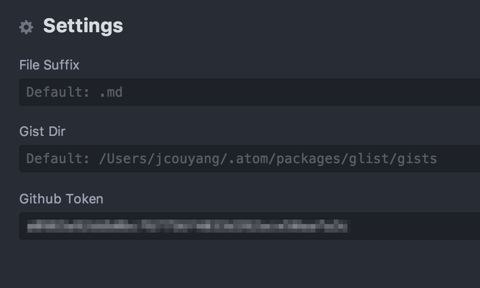
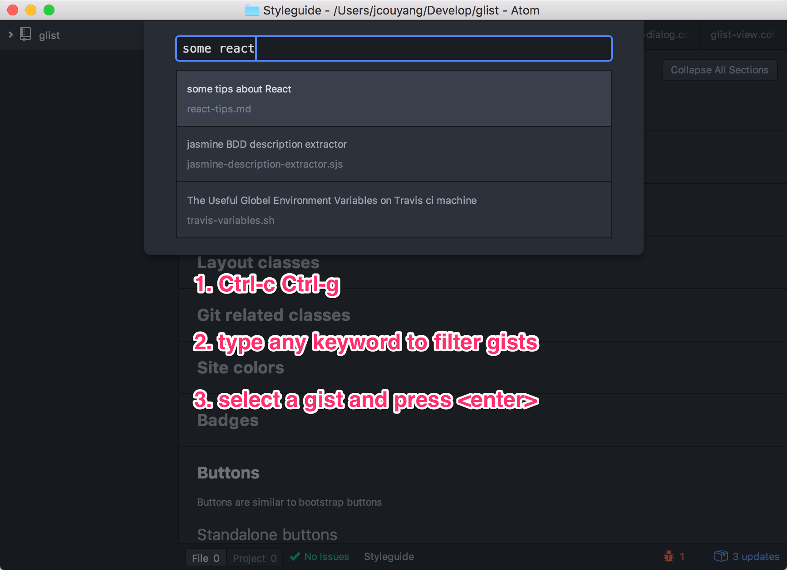
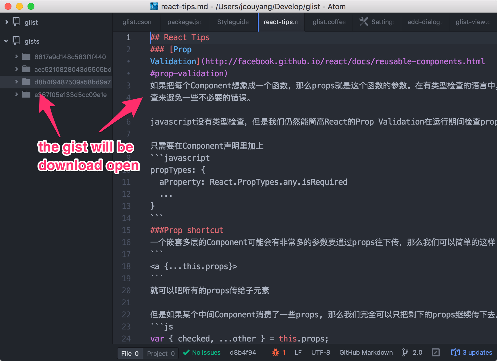
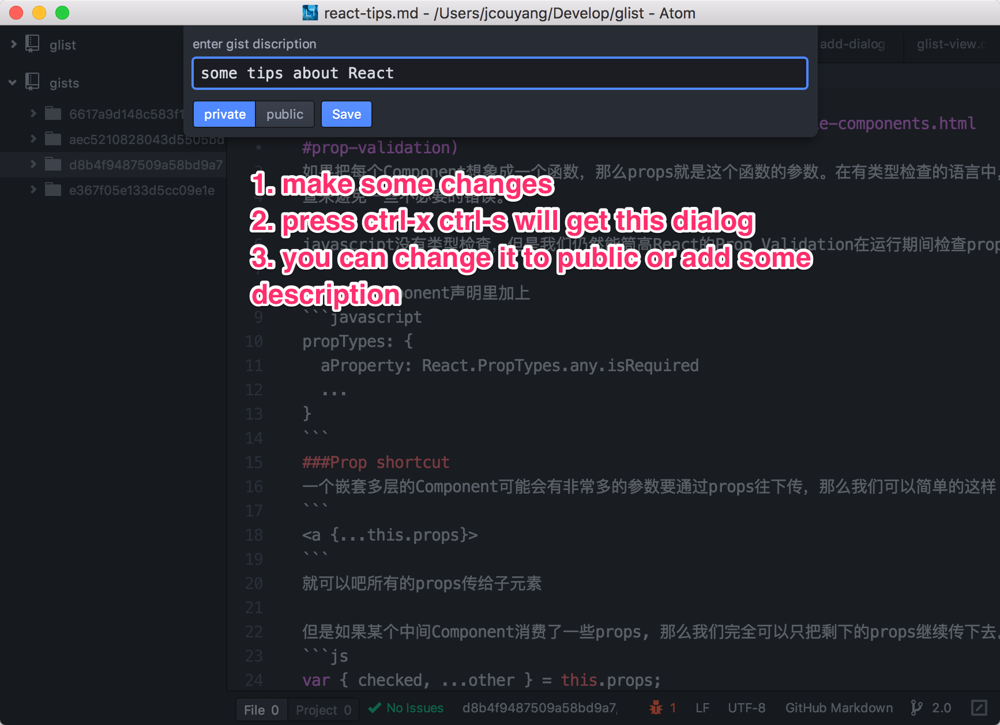
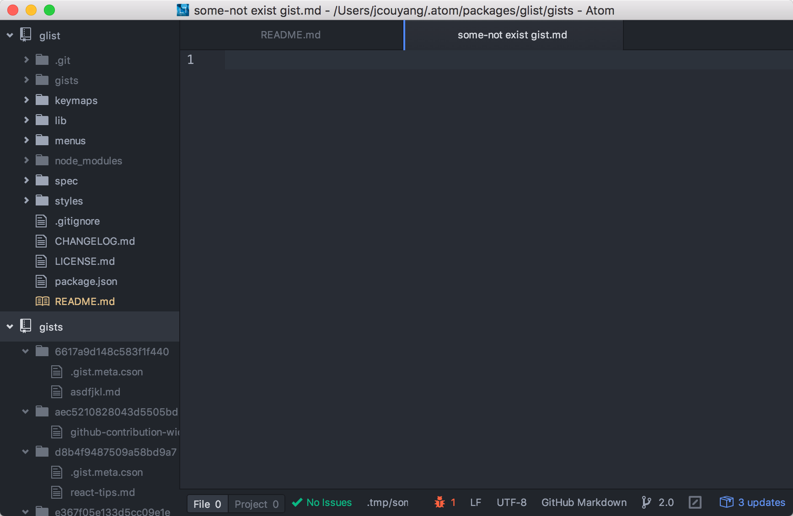

# glist 2.0


Taking notes with Github Gist from atom, inspired by national velocity.

## Rationale
1. gist is version controlled, and support almost all markup and programming language.
2. atom is awesome.
3. National Velocity is simple and awesome.

**glist** combine all these cool things

##Install
```
apm install glist
```

##Configure

### Github Token
1. get a github auth token via either [curl](https://developer.github.com/v3/oauth_authorizations/#create-a-new-authorization) or [gui](https://github.com/blog/1509-personal-api-tokens)
2. copy the token and paste to glist's setting

### Gist Directory
you can customize where to store your gist files, by default they are under `HOME/.atom/package/glist/gists`

:heavy_exclamation_mark: the path has to be a absolute, no relative, `~` doesn't work either

### default suffix for new gist
by default every new gist created is markdown.

## How to Use

### find/open gist



### edit gist

### create gist


### TODO: delete gist

### TODO: open gist on web

now I can use Atom and gist in place of National Velocity/Evernote :beer:
